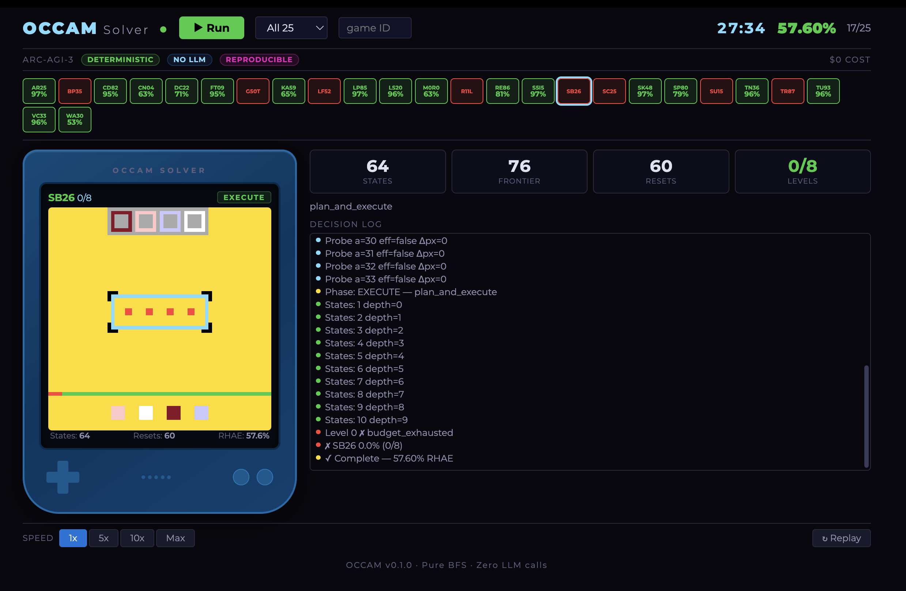

# Occam — Algorithmic Solver for ARC-AGI-3

Pure algorithmic ARC-AGI-3 solver. No LLM, no neural network, no API calls. 57.60% RHAE on 25 public games.

https://github.com/user-attachments/assets/71f1f044-5479-4aa4-b980-ccb3a9c8c496



## Results

| Metric | Value |
|---|---|
| RHAE Score | **57.60%** on 25 public ARC-AGI-3 games |
| Games Solved | 17 / 25 (122 / 183 levels) |
| Inference Cost | $0 |
| LLM Calls | 0 |
| Neural Networks | None |
| Runtime | ~27 minutes (CPU only) |
| Scorecard UUID | `bd33ee19-9220-43f5-84dd-bfe23c7f95e8` |

Results are self-reported on the public evaluation set and verified against ARC-AGI-3's own RHAE scoring implementation. The solver is deterministic with seed 42. Run it yourself to verify.

For comparison, the best prior reported result on the same evaluation set is Symbolica Agentica at 36.08% using frontier LLM agents at $1,005 per run. Verified frontier LLMs score below 1% on the private evaluation set.

## Quick Start

```bash
docker run -p 8080:8080 therealseandonahoe/occam
# Opens http://localhost:8080
```

Or install from source:

```bash
git clone https://github.com/TheRealSeanDonahoe/occam.git
cd occam
pip install -e .
occam run
# Opens http://localhost:8080
```

## How It Works

Occam runs a two-phase loop per game level:

1. **Discover** — probe available actions to map the environment, mask counters, deduplicate equivalent actions
2. **Execute** — select from six compositional strategies in fallback order:
   - Reactive click solver
   - Reactive navigation solver
   - Navigation solver (BFS pathfinding)
   - Combo search (exhaustive depth-limited)
   - Replay BFS (reset-replay tree search)
   - Deepcopy BFS

The Replay BFS strategy uses the reset-replay technique introduced by [Rudakov et al.](https://arxiv.org/abs/2512.24156), extended with incremental replay optimization, DFS-order iteration, and step-modulus hashing.

## Run Modes

| Mode | Command | Duration |
|---|---|---|
| Full Benchmark + Viewer | `occam run` | ~27 min |
| Quick Demo | `occam run --quick` | ~3 min |
| Single Game | `occam run --game SK48` | varies |
| Headless Benchmark | `occam benchmark` | ~27 min |

## Per-Game Results

| Game | Levels | RHAE |
|---|---|---|
| SK48 | 8/8 | 97.2% |
| S5I5 | 8/8 | 97.2% |
| AR25 | 8/8 | 97.2% |
| LP85 | 8/8 | 97.2% |
| LS20 | 7/7 | 96.4% |
| TN36 | 7/7 | 96.4% |
| VC33 | 7/7 | 96.4% |
| TU93 | 9/9 | 96.1% |
| CD82 | 6/6 | 95.2% |
| FT09 | 6/6 | 95.2% |
| RE86 | 8/8 | 80.7% |
| SP80 | 6/6 | 79.0% |
| DC22 | 6/6 | 70.7% |
| KA59 | 7/7 | 65.4% |
| M0R0 | 6/6 | 63.4% |
| CN04 | 6/6 | 63.4% |
| WA30 | 9/9 | 52.6% |

8 games unsolved (0% RHAE): BP35, G50T, LF52, R11L, SB26, SC25, SU15, TR87.

## Verification

Three mechanisms for independent verification:

1. **Run it yourself** — the solver is deterministic (seed 42) and produces identical results on any machine with the same Python/NumPy versions
2. **Scorecard UUID** — `bd33ee19-9220-43f5-84dd-bfe23c7f95e8` is the server-side receipt from ARC-AGI-3's evaluation system
3. **Audit trail** — complete event logs (332,796 events) recording every action, state discovery, and phase transition

## Developed Using

This solver was developed using Forge, a proprietary development framework. Forge is not required to run the solver and contributes no logic to it.

## Links

- Paper: [Zenodo (DOI: 10.5281/zenodo.19448189)](https://zenodo.org/records/19448189) | arXiv — coming soon
- Video: [Full benchmark run (27 min)](https://youtu.be/e-Dt9zR1kPk)

## License

MIT
